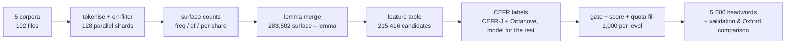

<div align="center">


### LexiCore-5000 — an open, evidence-ranked English core vocabulary list

5,000 headwords · A1–C1 · 1,000 per level · ranked on **13,632,611,970 words** from five corpora

[](LICENSE)
[](https://github.com/X-Trivle/LexiCore/actions/workflows/ci.yml)
[](data/LexiCore_5000.csv)
[](docs/PROVENANCE.md)
[](pyproject.toml)
[](https://whop.com/lexideck/lexideck-multilingual/)
[](https://assets-2-prod.whop.com/public/uploads/2026-09-20/305d9e95-7a9d-44b1-8471-76eb2b4f8748/application.apkg)

Docs · [Methodology](docs/METHODOLOGY.md) · [Provenance](docs/PROVENANCE.md) · [Data dictionary](docs/DATA_DICTIONARY.md) · [Validation](docs/VALIDATION.md) · [Known issues](docs/KNOWN_ISSUES.md) · [Artefacts](docs/ARTIFACTS.md) · [العربية](docs/OVERVIEW.ar.md)

</div>

> [!IMPORTANT]
> ### 🎴 Companion product: **LexiDeck Multilingual** — this list as a complete Anki system
>
> All **5,000 LexiCore words plus ~700 high-utility additions (≈5,700 words, A1–C1)**, with
> **5 different example sentences per word** (28,000+ sentences) that **rotate during review**,
> **38+ hours of human-recorded sentence audio**, headword audio, IPA, an illustration for every
> word, and **translations in 12 languages**.
>
> #### **→ [Get the full deck](https://whop.com/lexideck/lexideck-multilingual/)** &nbsp;·&nbsp; **⬇ [Download the free 50-word sample (`.apkg`)](https://assets-2-prod.whop.com/public/uploads/2026-09-20/305d9e95-7a9d-44b1-8471-76eb2b4f8748/application.apkg)**
>
> Built on this list, documented with measured evidence:
> [description](ecosystem/lexideck-multilingual/README.md) ·
> [card model & sample audit](ecosystem/lexideck-multilingual/DECK_STRUCTURE.md) ·
> [the ~700 additions](ecosystem/lexideck-multilingual/ADDITIONS.md)

---

LexiCore is a **core-vocabulary wordlist** for English, built the way a frequency list is
built — by counting — but then *selected* the way a teaching list should be selected: by
balancing raw frequency against how widely a word is dispersed across sources, how useful it
is for learners (NGSL / NAWL / BSL membership) and — in the design, though not yet in the data
of this release — how modern its evidence is ([KI-2](docs/KNOWN_ISSUES.md#ki-2-the-recency-axis-was-never-computed)).

Every word carries a CEFR level (A1–C1) taken from published, citable profiles wherever a
profile exists, and from a calibrated classifier only for the remainder.

| | |
|---|---|
| Headwords | **5,000**, unique, single-token, lower-case |
| Levels | A1 1,000 · A2 1,000 · B1 1,000 · B2 1,000 · C1 1,000 |
| Corroborated in all five corpora | **4,953** words (99.06%); in ≥4 corpora: 99.98% |
| Occurrences of these 5,000 lemmas | **9,705,062,231** (71.2% of the 13.63 B words counted) |
| Level provenance | CEFR-J v1.5 → 3,898 · Octanove C1/C2 → 665 · multinomial-logit model → 437 |
| vs Oxford 5000 (comparison only) | 3,526 shared (70.5% of LexiCore), Jaccard 0.5508, quadratic κ 0.7124 |
| Licence | **[CC BY 4.0](LICENSE)** — see [NOTICE.md](NOTICE.md) for third-party terms |

## 60 seconds of use

```bash
git clone https://github.com/X-Trivle/LexiCore.git && cd LexiCore
pip install -e .            # optional: only needed for the CLI / helpers
```

```python
from lexicore import load_entries, entry_for, words_by_level

a1 = words_by_level("A1")                     # 1,000 words, release order
e = entry_for("agreement")                     # -> Entry(...) or None
print(e.cefr_level, e.total_count, f"{e.per_million:.1f} ppm")   # B1 1100444 80.7 ppm
```

```bash
python -m lexicore words --level B2 --sort alpha --limit 10   # a printable handout
python -m lexicore show --word agreement                      # one row, as JSON
python -m lexicore validate                                   # the CI integrity gate
python -m lexicore stats                                      # headline numbers
```

For research you may also want the **release checkpoint** (743 MB of per-source counters, the full
feature table, labels and the selection detail) — it is an asset of
[release v1.0.0](https://github.com/X-Trivle/LexiCore/releases/tag/v1.0.0), not tree content, and
`data/derived/` in this repository is a deterministic rebuild of the parts you are most likely to
need.

No dependency, no download step: the list is a plain CSV, so `curl` works too.

```bash
curl -LO https://raw.githubusercontent.com/X-Trivle/LexiCore/main/data/LexiCore_5000.csv
```

## What's in the box

```
data/
├── LexiCore_5000.csv            canonical 5,000-row list  (schema: docs/DATA_DICTIONARY.md)
├── LexiCore_5000.json           same rows + per-corpus ppm; machine-friendly
├── LexiCore_5000.txt            words only, one per line, in rank order
├── oxford_comparison_sets.csv   1,474 LexiCore-only + 1,402 Oxford-only words
├── MANIFEST.json                upstream release manifest: method, sources, hashes
├── SHA256SUMS.txt               integrity ledger for every file below data/, docs/, …
├── lists/                       per-level handouts (rank order + alphabetical)
└── derived/
    ├── candidate_features.csv.gz  215,416 candidates × the full feature vector
    ├── candidate_labels.csv.gz    CEFR level, label source, confidence, class probabilities
    └── surface_to_lemma.csv.gz    283,502 inflected surface forms → lemma
docs/                            methodology, provenance, validation, known issues, how to rebuild
reports/upstream/                the release's own reports and stage logs, unmodified
ecosystem/lexideck-multilingual/ the Anki deck built on this list (+ ~700 extra words)
src/lexicore/                    stdlib-only loader, validator, re-scoring experiment harness
tests/ · scripts/ · Makefile     the checks behind the badge
```

**Why `data/derived/` matters:** it contains the *whole candidate pool* — all 215,416 lemmas
with the exact features the release scored them on. You can re-run the selection with your own
weights without re-processing a single corpus file:

```bash
python -m lexicore reweight --freq 0.5 --disp 0.25 --util 0.25   # diff against the shipped mix
```

## How the list was built



Score = `0.34·freq + 0.18·disp + 0.18·util + 0.10·ent + 0.08·rng + 0.06·df + 0.06·rec`
(z-scored over the eligible pool). Full description, stage-by-stage timings and the funnel
(`215,416 → 119,155 eligible → 5,000 selected`) live in **[docs/METHODOLOGY.md](docs/METHODOLOGY.md)**.

## Provenance is checkable, not asserted

Each source entry in `MANIFEST.json` records the exact file URL, byte size and SHA-256. We
re-checked some of them against the live servers, and the numbers matched exactly — e.g.
`sample/10BT` really contains **15** parquet shards (the release used all 15) at
2,147,292,183 bytes for shard `000_00000.parquet`, whose git-LFS oid equals the recorded
SHA-256. Details, live-check log and the licence table: **[docs/PROVENANCE.md](docs/PROVENANCE.md)**.

## Read this before you quote the list

We publish the flaws as loudly as the features, because a wordlist that hides them is useless
to teachers. Summary — full detail in **[docs/KNOWN_ISSUES.md](docs/KNOWN_ISSUES.md)**:

| # | Issue | Effect |
|---|---|---|
| KI-2 | The recency axis was never computed: `recent_share_2022plus` and `newest_share_2025_2026` are empty in 5,000/5,000 rows and in 0/215,416 candidates | The 0.06 `rec` weight is inert; do **not** describe this release as "recency-ranked" |
| KI-1 | The upstream report's "notable modern additions, ranked by 2025-26 evidence" list is in fact alphabetical | Treat that section as illustrative, not measured |
| KI-3 | `pos` comes from a dictionary lookup, not from tagging: `at`/`be`/`a` are labelled *noun*, 72% of the list is *noun* | Don't ship POS to learners without review |
| KI-4 | The classifier that levels 437 words scores CV accuracy 0.3814 / macro-F1 0.3829 (majority class ≈ 0.32) | ~8.7% of levels are weak evidence |
| KI-5 | `confidence` is a constant 0.97 (CEFR-J) or 0.95 (Octanove) for profile labels | The mean 0.9205 is a mix of caps and real posteriors; not calibrated |
| KI-6 | C1 is a catch-all: 97,963 C1 candidates vs 1,380 B2 | C1 membership ≠ rarity ordering; the level pool is heavily imbalanced |
| KI-7 | `subs` dispersion is measured over 198.8 M subtitle *lines*, not documents | Cross-source `disp`/`dfr` are not on one scale |
| KI-8 | Reported "Files" counts mix downloaded files with compute chunks (115 = 15 + 100) | Use the per-source file table in PROVENANCE.md |

## Relationship to other wordlists

* **Oxford 5000** is used *externally* for comparison only — it never entered the construction
  of LexiCore (see `MANIFEST.json → oxford_comparison.note`). Agreement on shared words is
  0.466 exact / 0.8659 within one band.
* **NGSL / NAWL / BSL / BNC-COCA / CEFR-J / Octanove** are used as anchors and validity gates.
  Their own licences apply to those files, which are **not** redistributed here — see [NOTICE.md](NOTICE.md).

## 🎴 LexiDeck Multilingual — the deck built on this list

<p align="center">
  <a href="https://whop.com/lexideck/lexideck-multilingual/">
    
  </a>
  &nbsp;
  <a href="https://assets-2-prod.whop.com/public/uploads/2026-09-20/305d9e95-7a9d-44b1-8471-76eb2b4f8748/application.apkg">
    
  </a>
</p>

**Product page:** <https://whop.com/lexideck/lexideck-multilingual/>
**Free 50-word sample:** [application.apkg](https://assets-2-prod.whop.com/public/uploads/2026-09-20/305d9e95-7a9d-44b1-8471-76eb2b4f8748/application.apkg) *(5,877,461 bytes, verified live)*
**In this repository:** [README of the deck](ecosystem/lexideck-multilingual/README.md) ·
[measured card structure](ecosystem/lexideck-multilingual/DECK_STRUCTURE.md) ·
[the ~700 additions](ecosystem/lexideck-multilingual/ADDITIONS.md) ·
[screenshots](ecosystem/lexideck-multilingual/assets/)

LexiDeck Multilingual is an Anki-based English vocabulary system designed around context,
repetition, audio, images, pronunciation, and varied examples rather than isolated word
memorization.

It contains more than **5,700 English words from A1 to C1**, with **5 different example sentences
for every word**, giving you more than **28,000 example sentences** in total. The examples rotate
during reviews, so you repeatedly encounter the same vocabulary in different contexts instead of
seeing one sentence every time.

The deck also contains more than **38 hours of human-recorded sentence audio**, plus audio for the
headwords, IPA pronunciation, and a visual illustration for every word. The sentence collection
contains roughly **1.8 million characters of written content**, providing a substantial amount of
contextual English practice.

#### Included

- 5,700+ English words, covering A1–C1
- 28,000+ example sentences
- 5 different examples for each word
- Rotating examples during reviews
- 38+ hours of human-recorded sentence audio
- Human-recorded audio for the example sentences
- Headword pronunciation audio
- IPA pronunciation
- An illustration for every word
- Translations in 12 languages
- Anki spaced-repetition system
- Context-based learning rather than isolated vocabulary
- Examples covering different ways words are naturally used

#### 12 supported languages

中文 · हिन्दी · Español · العربية · Português · 한국어 · 日本語 · Bahasa Indonesia · Русский · اردو · Français · Deutsch

The amount of written example material is roughly comparable to **several full-length books**,
while the 38+ hours of recorded sentence audio represents dozens of hours of listening practice.
The exact book or video equivalent depends on the average length of the books or videos being
compared, so these figures are best understood as a rough indication of the amount of material
rather than a fixed conversion.

The goal is straightforward: give you enough vocabulary, repeated exposure, context, listening,
pronunciation, and visual information to make Anki reviews more useful than simply memorizing a
list of translations.

<p align="center">
  
  &nbsp;
  
  &nbsp;
  
</p>

###### In-review screenshots of LexiDeck Multilingual in AnkiDroid (supplied by the product owner). *

**How it relates to the list:** every deck note is tagged `LexiCore` and carries this release's
CEFR band, so the lineage is checkable rather than claimed. In the free sample, 44 of 50 notes
match a LexiCore headword and 6 come from the additions; the deck's `order` field is its own
sequence over ≈5,700 items and is **not** this list's `rank_global`
([measured in DECK_STRUCTURE.md](ecosystem/lexideck-multilingual/DECK_STRUCTURE.md)).

## Contributing## Contributing

Start with **[CONTRIBUTING.md](CONTRIBUTING.md)**. Everything a change must satisfy is a
command, not a convention:

```bash
make install && make validate && make test && make lint
make checksums      # verify the ledger after re-pointing data/
make ledger         # regenerate data/SHA256SUMS.txt after an approved data change
```

Data changes go through an issue first (see the `data-request` template); the ledger and CI
make silent, unreviewed edits to `data/` impossible.

## Licence & citation

The list and the code in this repository are released under
**[CC BY 4.0](LICENSE)**. Third-party corpora and anchor lists keep their own terms
([NOTICE.md](NOTICE.md) — not legal advice).

```bibtex
@misc{lexicore2026,
  title  = {LexiCore-5000: an open, evidence-ranked English core vocabulary list (A1--C1)},
  year   = {2026},
  author = {{LexiCore maintainers}},
  url    = {https://github.com/X-Trivle/LexiCore},
  note   = {release 1.0.0, generated 2026-09-14; CC BY 4.0}
}
```
